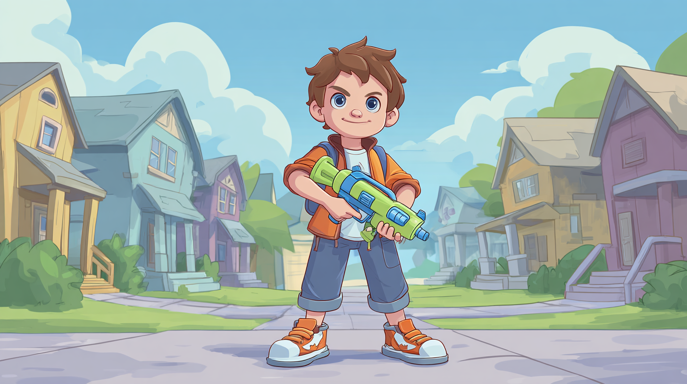
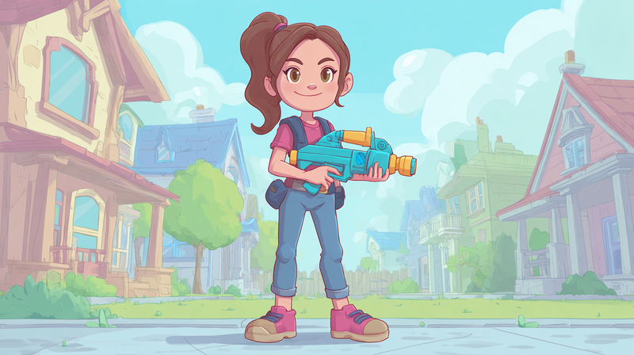

  

  

  

  

# Zombie Apocalypse

**Leer Python programmeren door een zombie spel te bouwen!**

  <input type="radio" name="hero" id="hero-boy" checked>
  <input type="radio" name="hero" id="hero-girl">
  

    
    
  

  
Leer Python door zombies te verslaan!

  

    <label for="hero-boy">Jongen</label>
    <label for="hero-girl">Meisje</label>
  

Dit project is gemaakt voor CoderDojo. Je leert stap voor stap programmeren, van simpele keuzes tot complete functies.

## Voor wie is dit?

- Zombie overlevers tussen 8 en 16 jaar
- Je hebt Scratch gedaan en wil "echte" code leren
- Je houdt van games en zombies 🧟

## Wat ga je leren?

| Level | Concept       | Wat je bouwt                    |
|-------|---------------|---------------------------------|
| 1     | `if`/`else`   | Keuzes maken: rennen of vechten |
| 2     | `while` loops | Levens systeem, game loop       |
| 3     | Lijsten       | Inventory, zombie types         |
| 4     | Functies      | Georganiseerde code             |
| 5     | Pygame Zero   | Grafische game                  |

## Hoe werkt het?

1. **BEKIJK** - Run de code, speel het spel
2. **LEES** - Begrijp wat de code doet
3. **PROBEER** - Maak een kleine aanpassing
4. **UITDAGING** - Kies een uitdaging kaart

## Uitdagingen

Elke level heeft uitdagingen in drie moeilijkheden:

| Niveau       | Beschrijving                         |
|--------------|--------------------------------------|
| **Opwarmer** | Kleine aanpassingen om op te warmen  |
| **Pittig**   | Extra dingen toevoegen               |
| **Boss**     | Grotere uitdagingen voor gevorderden |

## Begin hier

👉 [Aan de Slag](aan-de-slag.md) - Installeer Python en VS Code

👉 [Level 1](levels/level-1/uitleg.md) - Start met programmeren!
