# ☣ Referentiekaarten

Handige kaarten om naast je laptop te leggen terwijl je programmeert!

**Print ze uit** of bekijk ze op je scherm.

---

## Foutmeldingen — Ken Je Vijand! { data-toc-label="Foutmeldingen" }

Elke foutmelding is een zombie die je moet leren verslaan.
Hoe beter je ze kent, hoe sneller je ze uitschakelt!

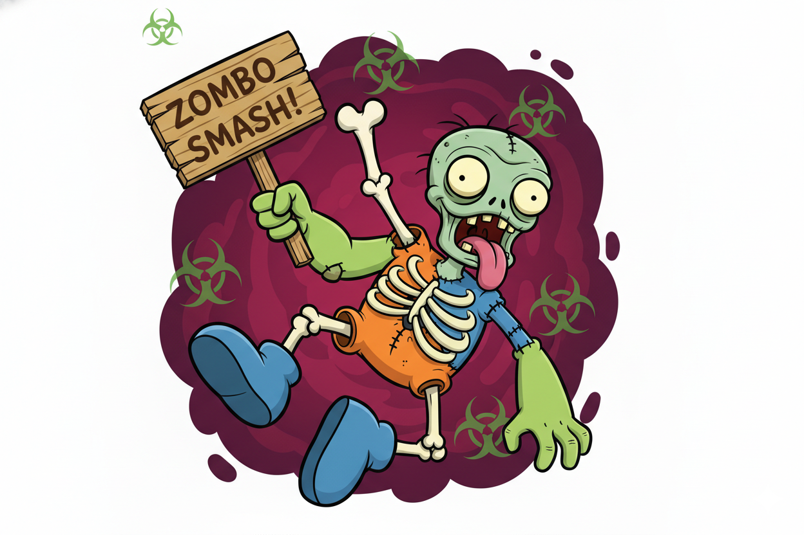

#### ☣ SyntaxError — De Verminkte Zombie { data-toc-label="SyntaxError" }

Python snapt je code niet! Er mist een `:` na if/while/def, aanhalingstekens `""` niet gesloten, of haakjes `()` vergeten.

**Versla hem:** Kijk naar het **einde van de regel** die Python aanwijst. Mis je een `:` of `"`? Check ook de regel **erboven**!

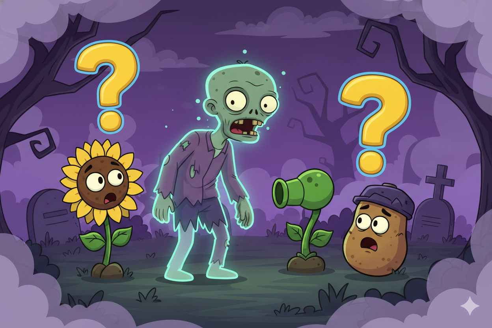

#### ☣ NameError — De Onzichtbare Zombie { data-toc-label="NameError" }

Python kent deze naam niet! Een variabele die niet bestaat, een typfout in de naam, of je bent vergeten hem aan te maken.

**Versla hem:** Check de **spelling** — `levens` is niet `Levens`. Is de variabele al aangemaakt **boven** deze regel?

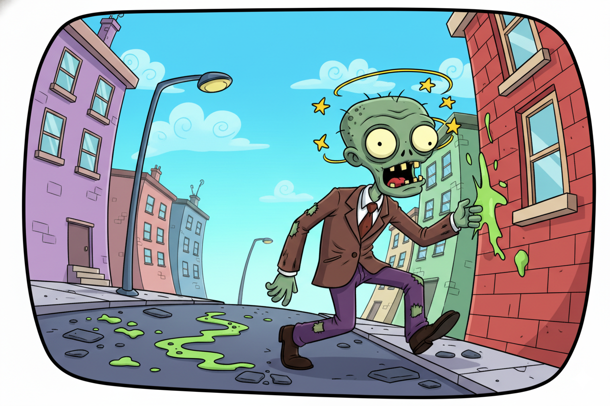

#### ☣ IndentationError — De Dronken Zombie { data-toc-label="IndentationError" }

Je code staat niet recht! Na `if`, `while`, of `def` moet de volgende regel inspringen met spaties.

**Versla hem:** Gebruik **4 spaties** (of Tab) na elke `:`. Meng nooit tabs en spaties! Kijk of alles **netjes onder elkaar** staat.

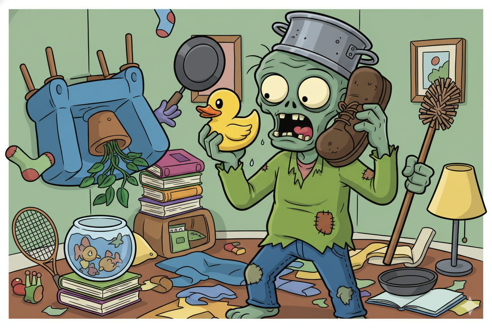

#### ☣ TypeError — De Verwarde Zombie { data-toc-label="TypeError" }

Je mixt dingen die niet samen kunnen! Tekst en getallen optellen, of een functie verkeerd aanroepen.

**Versla hem:** Gebruik `str()` om een getal naar tekst om te zetten, of `int()` voor tekst naar getal. Check: `"Score: " + str(score)`

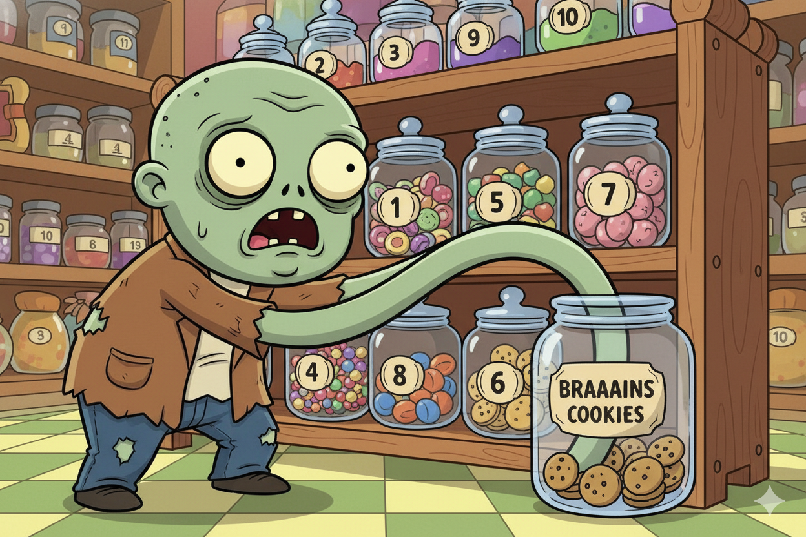

#### ☣ IndexError — De Gulzige Zombie { data-toc-label="IndexError" }

Je grijpt naar iets dat er niet is! De lijst heeft minder items dan je denkt. Lijsten beginnen bij `0`, niet bij `1`!

**Versla hem:** Een lijst met 3 items heeft index `0`, `1`, `2`. Gebruik `len(lijst)` om te checken hoeveel items er zijn.

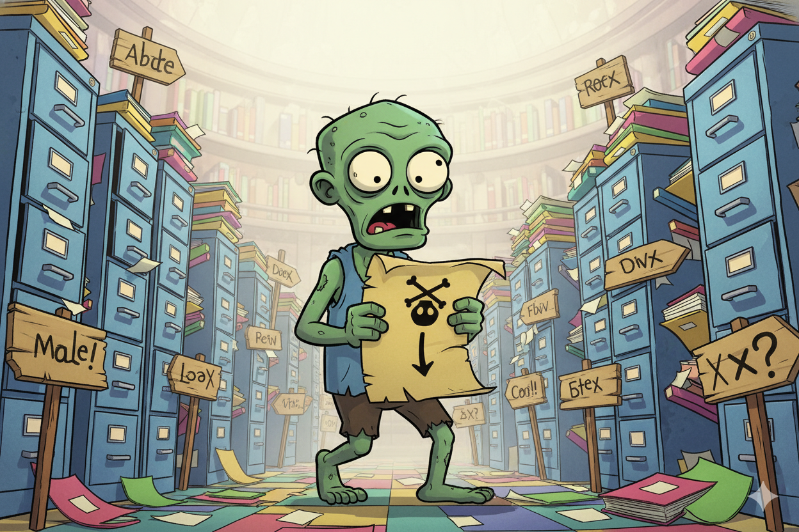

#### ☣ FileNotFoundError — De Verdwaalde Zombie { data-toc-label="FileNotFoundError" }

Python kan het bestand niet vinden! Verkeerd pad, verkeerde naam, of het bestand bestaat nog niet.

**Versla hem:** Check de **bestandsnaam** en het **pad**. Staat het bestand in dezelfde map als je script? Tip: `open("scores.txt", "w")` maakt een nieuw bestand.

---

## Overlevingskaarten — Wat Heb Je Geleerd? { data-toc-label="Overlevingskaarten" }

Elke level geeft je nieuwe krachten. Hier is je arsenaal!

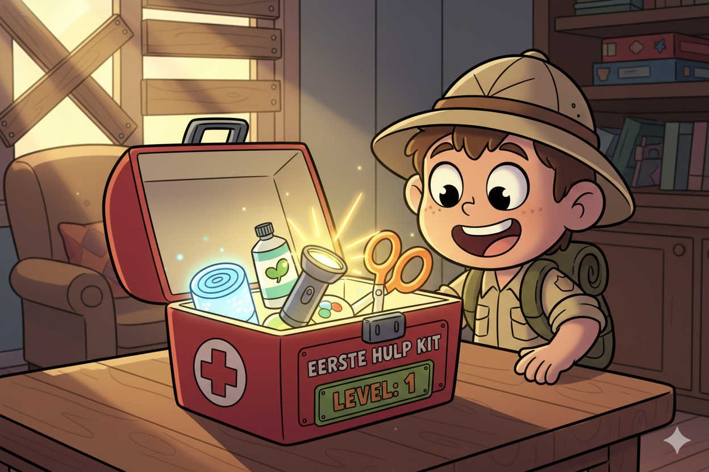

#### Level 1 — Eerste Hulp Kit { data-toc-label="Level 1" }

| | Code | Wat doet het? |
|---|---|---|
| 🖨️ | `print("tekst")` | Tekst op het scherm zetten |
| 🎤 | `actie = input("...")` | De speler iets laten typen en opslaan |
| 🔀 | `if / elif / else` | Verschillende keuzes maken |
| 🎲 | `random.randint(1, 2)` | Willekeurig getal kiezen (zoals een dobbelsteen) |
| ⏳ | `time.sleep(1)` | 1 seconde wachten (voor de spanning!) |
| ⚠️ | `=` opslaan, `==` vergelijken | `actie = "rennen"` vs `actie == "rennen"` |

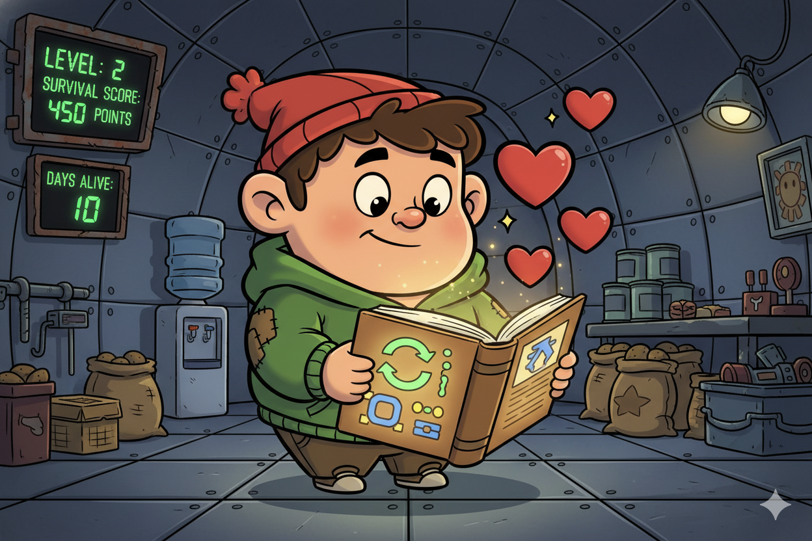

#### Level 2 — Overlevingsgids { data-toc-label="Level 2" }

| | Code | Wat doet het? |
|---|---|---|
| 🔄 | `while levens > 0:` | Herhaal zolang de voorwaarde waar is |
| 💔 | `levens = levens - 1` | Een variabele veranderen (1 afhalen) |
| ⚖️ | `> < == != >= <=` | Getallen vergelijken (groter, kleiner, gelijk) |
| 🪆 | `while:` ↳ `if:` | Code in code: de spaties moeten exact uitgelijnd zijn! |

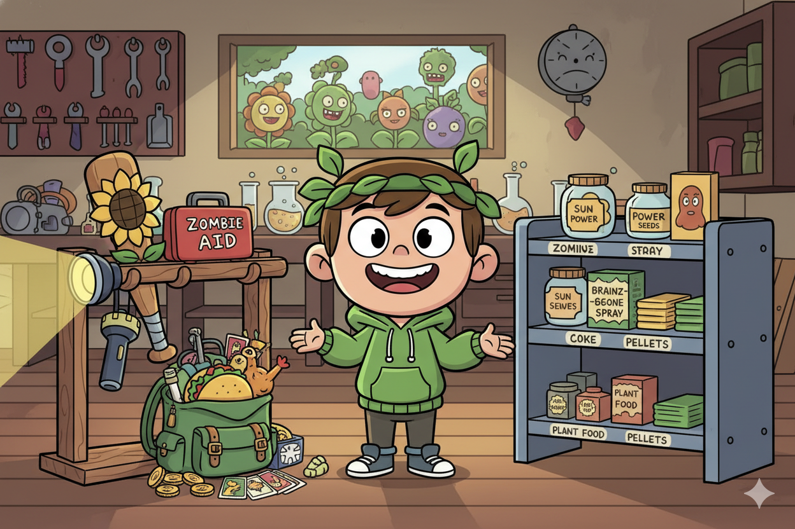

#### Level 3 — Wapenarsenaal { data-toc-label="Level 3" }

| | Code | Wat doet het? |
|---|---|---|
| 📋 | `lijst = [a, b, c]` | Meerdere dingen bewaren in een lijst |
| ➕ | `lijst.append(x)` | Een item achteraan toevoegen |
| ➖ | `lijst.remove(x)` | Een item verwijderen uit de lijst |
| 🔍 | `if x in lijst:` | Checken of iets in de lijst zit |
| 🎯 | `random.choice(lijst)` | Willekeurig een item kiezen uit de lijst |
| ✨ | `f"Score: {score}"` | Variabelen in tekst zetten met f-strings |

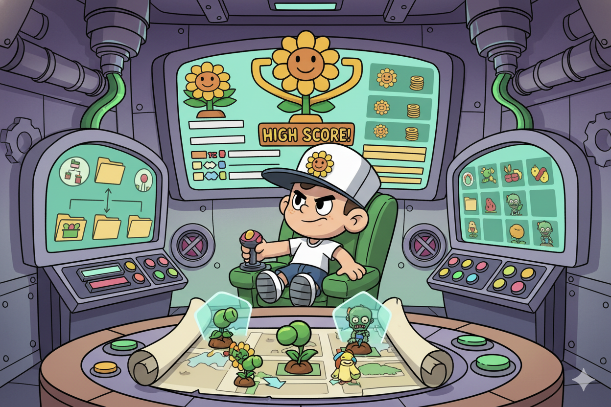

#### Level 4 — Commandocentrum { data-toc-label="Level 4" }

| | Code | Wat doet het? |
|---|---|---|
| ⚙️ | `def functie(x):` | Code een naam geven en hergebruiken |
| 🔢 | `return waarde` | Een waarde teruggeven aan wie de functie aanriep |
| 📖 | `{"naam": "waarde"}` | Gegevens opslaan als sleutel-waarde paren |
| 🔑 | `zombie["naam"]` | Een waarde opvragen met de sleutel |
| 🧹 | `.lower()` `.strip()` | Tekst omzetten naar kleine letters en spaties weghalen |
| 🚫 | `None` | Betekent "niks" — als er geen resultaat is |

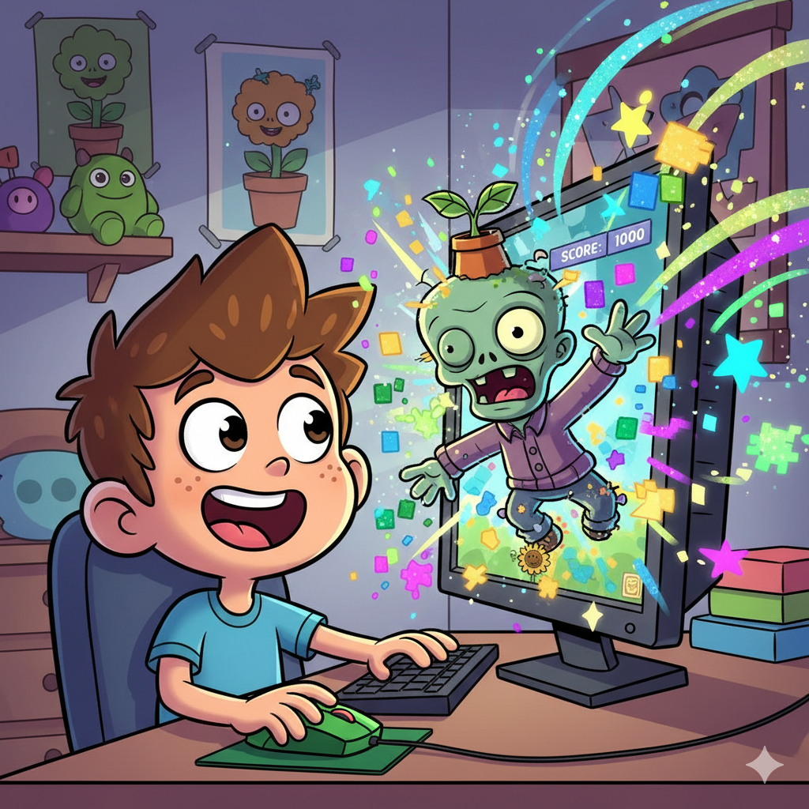

#### Level 4.5 — Eerste Contact { data-toc-label="Level 4.5" }

| | Code | Wat doet het? |
|---|---|---|
| 🎮 | `actor = Actor("zombie")` | Sprite uit `images/` map op het scherm |
| 🖌️ | `def draw():` | Tekenen op het scherm (60x per seconde!) |
| 🖱️ | `on_mouse_down(pos)` | `pos` is (x, y) van de klik |
| 💥 | `actor.collidepoint(pos)` | Checken of een klik de actor raakt |
| 🎨 | `screen.fill("kleur")` | Het hele scherm vullen met een kleur |
| 🔊 | `sounds.whack.play()` | Geluid uit `sounds/` map afspelen |

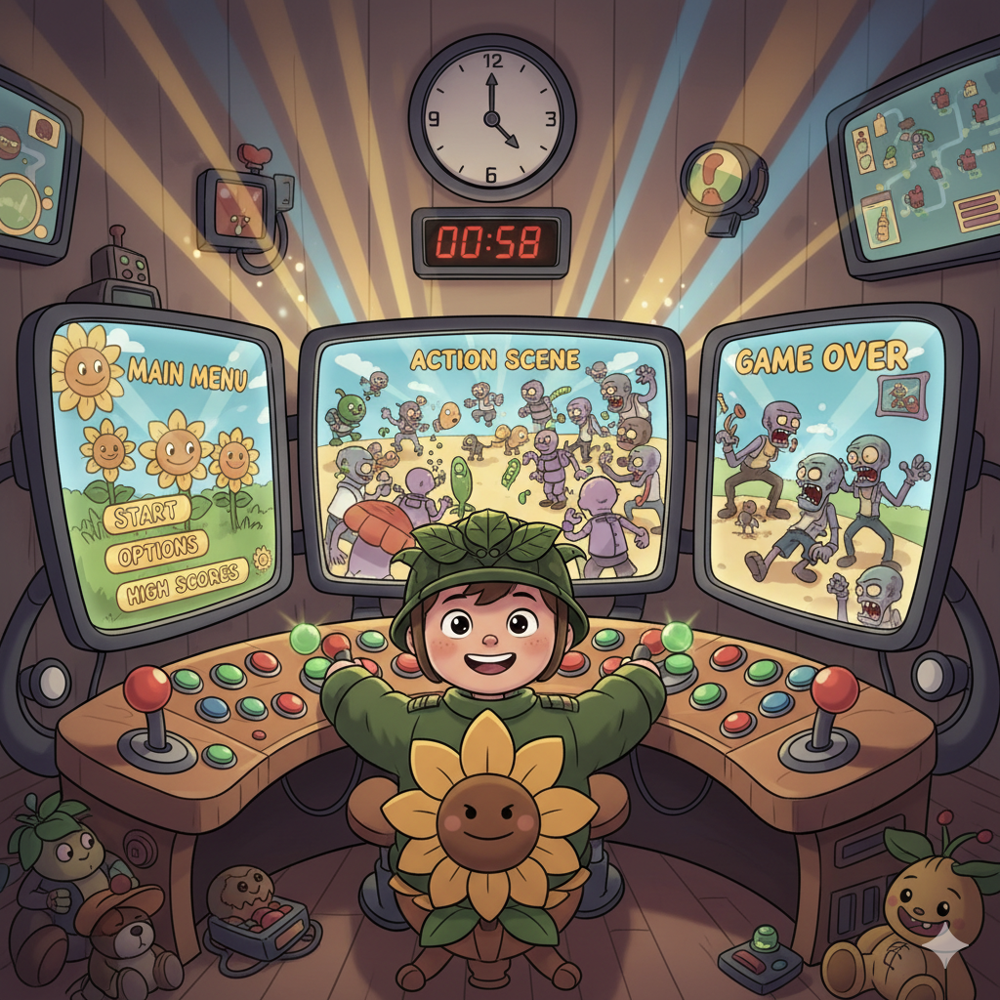

#### Level 5 — Volledige Aanval { data-toc-label="Level 5" }

| | Code | Wat doet het? |
|---|---|---|
| 🔲 | `Rect(x, y, b, h)` | x, y, breedte, hoogte |
| 🔄 | `def update(dt):` | Elk frame updaten (voor animaties) |
| 📺 | `toestand = "spel"` | Game states: schakelen tussen schermen |
| ⏰ | `clock.schedule(f, 2.5)` | Functie f na 2.5 seconden uitvoeren |
| 🖼️ | `screen.blit("img", pos)` | Een plaatje tekenen op een positie |
| 🌐 | `global variabele` | Variabele aanpassen binnen een functie |

