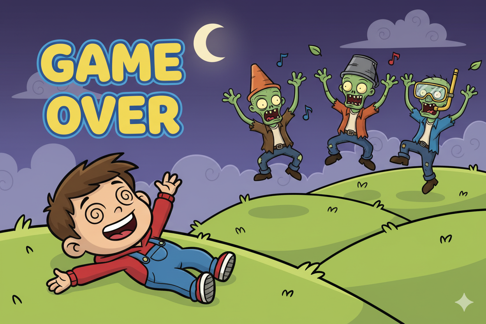
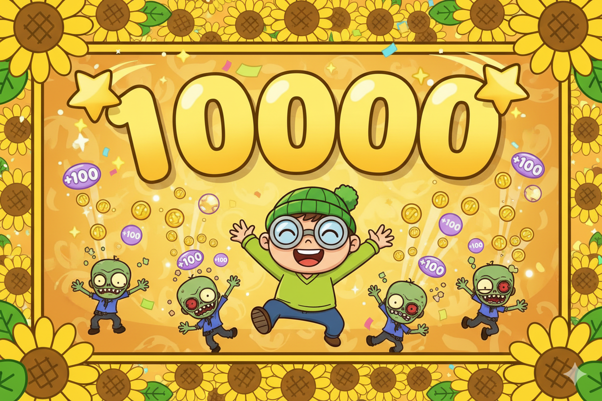
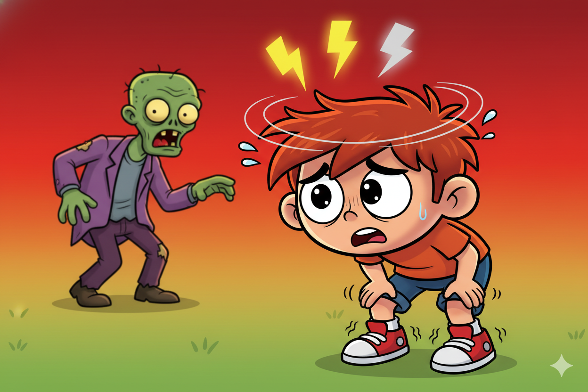
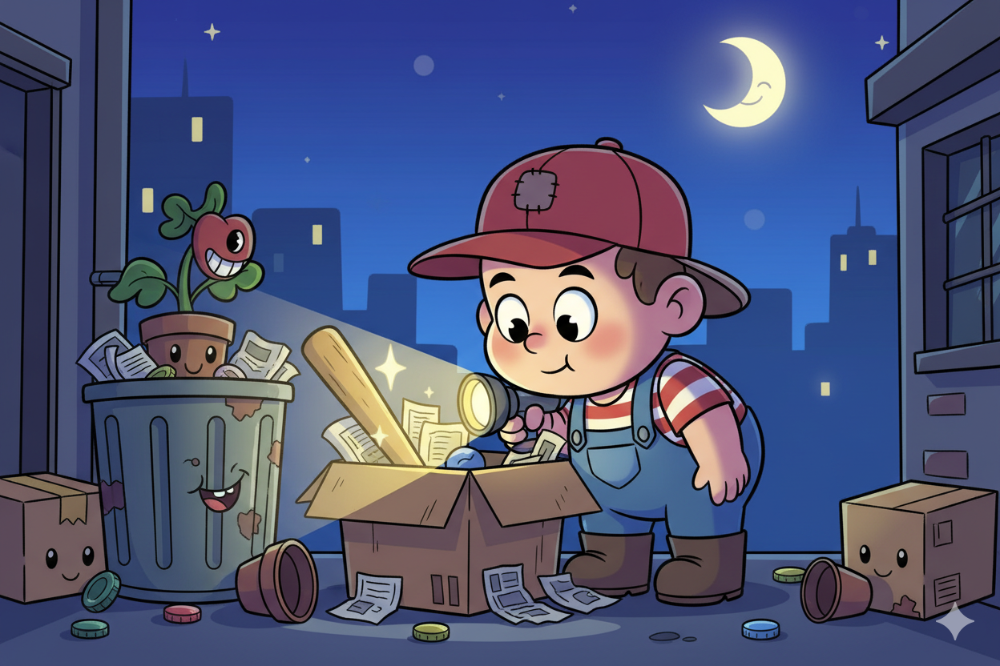
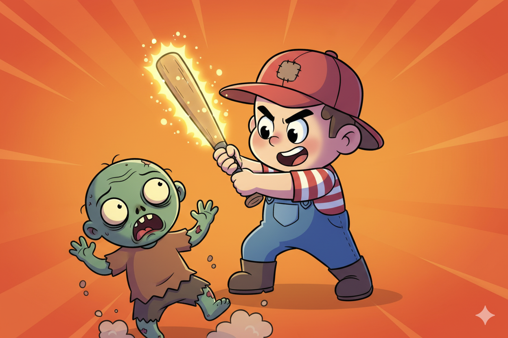

# Level 2 Uitdagingen

## Opwarmer

### Game Over Bericht

Voeg een speciaal bericht toe als je dood gaat



**Hint:** Voeg code toe NA de while loop maar VOOR "THE END"

??? note "Spieken"
    ```python
    while levens > 0:
        # ... bestaande code ...

    print("GAME OVER")
    print("De zombies hebben gewonnen...")

    print("THE END")
    ```

---

## Pittig

### Score Systeem

Voeg een score toe die omhoog gaat per overwonnen zombie



**Hint:** Maak `score = 0` aan het begin, en `score += 10` als je wint

??? note "Spieken"
    ```python
    levens = 3
    score = 0

    while levens > 0:
        print(f"Levens: {levens} | Score: {score}")

        # ... bestaande code ...

        # Bij winnen:
        if kans >= 2:
            print("Je verslaat de zombie!")
            score += 10

    print(f"Eindscore: {score}")
    ```

---

### Stamina

Je kunt niet eeuwig blijven rennen! Voeg een `⚡⚡○` stamina systeem toe.



Bij 0 stamina: "Je bent te moe om te rennen!" en je verliest een leven

**Hint:** Voeg een variabele toe `stamina = 3` en doe `stamina = stamina - 1` als je rent.

??? note "Spieken"
    ```python
    levens = 3
    stamina = 3

    while levens > 0:
        print(f"Levens: {levens} | Stamina: {stamina}")

        # ... bestaande intro code ...

        actie = input("Wat doe je? (rennen / vechten) ")

        if actie == "rennen":
            if stamina <= 0:
                print("Je bent te moe om te rennen!")
                print("De zombie pakt je...")
                levens = levens - 1
            else:
                stamina = stamina - 1
                kans = random.randint(1, 2)
                if kans == 1:
                    print("Je bent ontsnapt!")
                else:
                    print("De zombie was sneller!")
                    levens = levens - 1

        elif actie == "vechten":
            # ... bestaande vecht code ...
    ```

---

## Boss

### Wapen Zoeken

Voeg een "zoeken" actie toe om een wapen te vinden



**Hint:** Maak een variabele `heeft_wapen = False` aan het begin

??? note "Spieken"
    ```python
    heeft_wapen = False

    while levens > 0:
        # ... bestaande intro code ...

        actie = input("Wat doe je? (rennen / vechten / zoeken) ")

        if actie == "zoeken":
            if not heeft_wapen:
                print("Je zoekt rond...")
                print("Je vindt een honkbalknuppel!")
                heeft_wapen = True
            else:
                print("Je hebt al een wapen!")

        elif actie == "rennen":
            # ... bestaande code ...
    ```

---

### Wapen Bonus

Het wapen verhoogt je winkans bij vechten



**Hint:** Check `if heeft_wapen:` en pas de `random.randint()` aan

??? note "Spieken"
    ```python
    elif actie == "vechten":
        print("Je maakt je klaar om te vechten...")
        time.sleep(1)

        if heeft_wapen:
            print("Je zwaait met je honkbalknuppel!")
            kans = random.randint(1, 3)  # 2 van 3 kans om te winnen
        else:
            kans = random.randint(1, 2)  # 1 van 2 kans om te winnen

        if kans >= 2:
            print("Je verslaat de zombie!")
        else:
            print("De zombie bijt je...")
            levens = levens - 1
    ```
