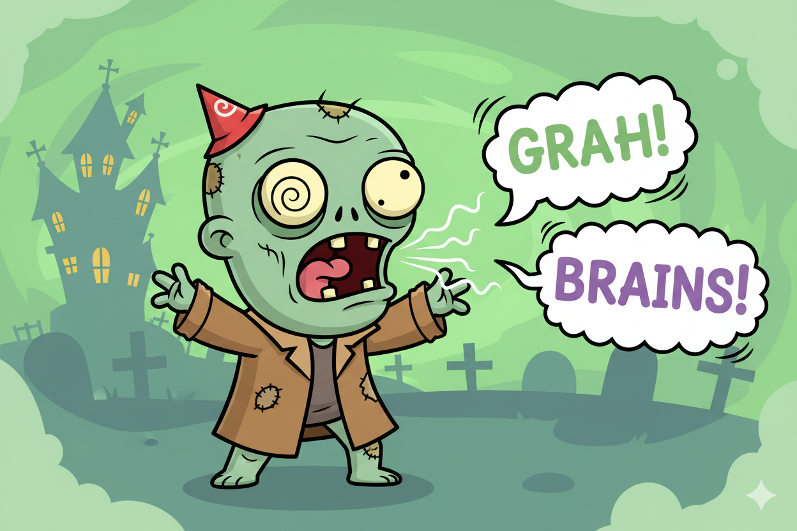
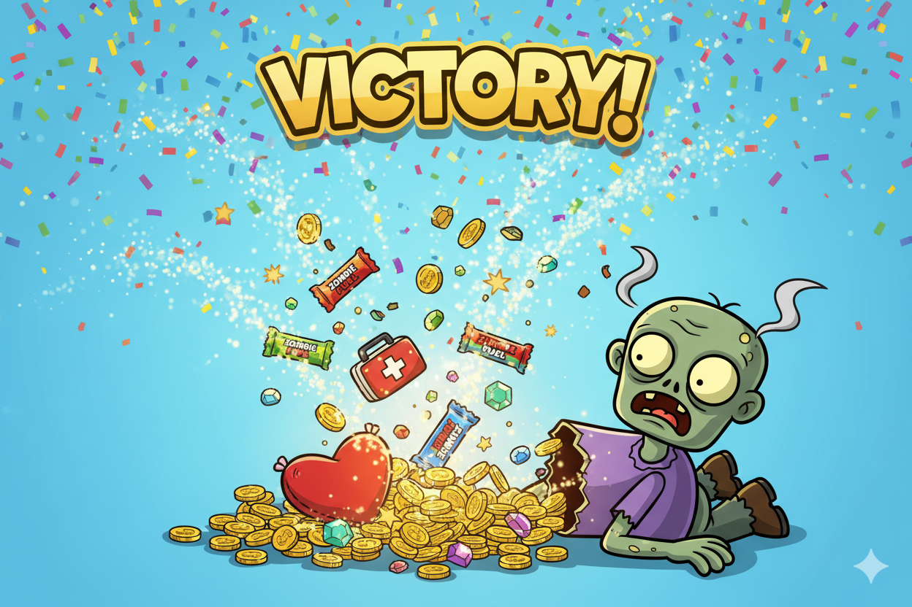
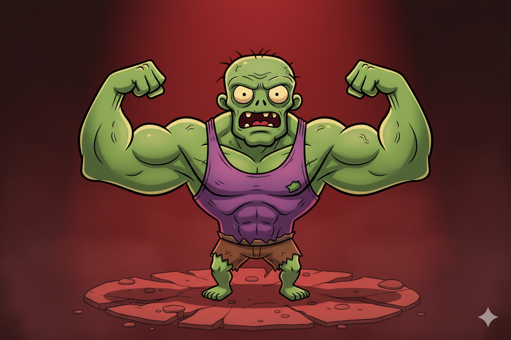
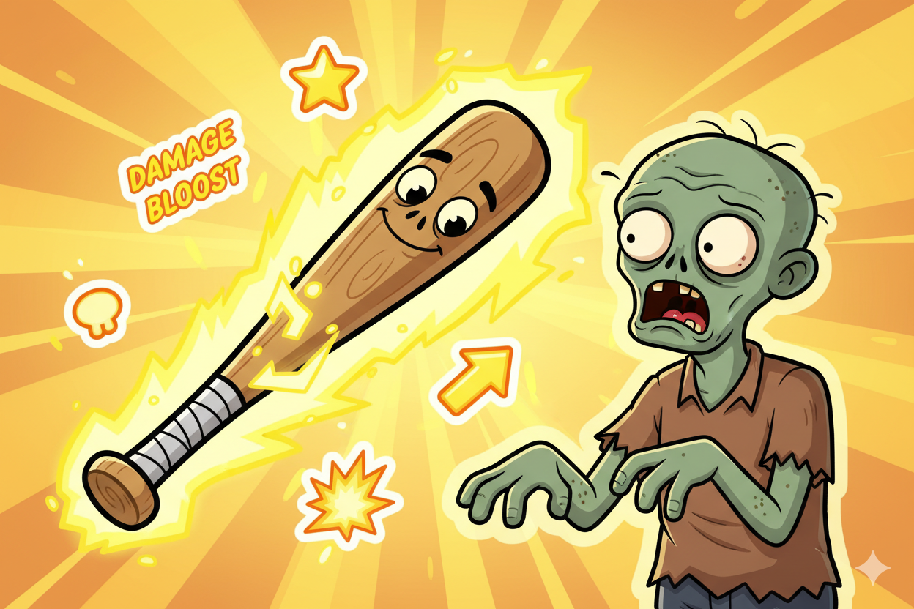

# Level 3 Uitdagingen

## Opwarmer

### Zombie Geluiden



Laat de zombie een geluid maken als hij verschijnt

**Hint:** Maak een lijst `zombie_geluiden = ["GRAAH!", "BRAINS!", ...]` en gebruik `random.choice()`

??? note "Spieken"
    ```python
    zombie_geluiden = ["GRAAAAAH!", "BRAAAAINS!", "UGHHHH...", "GRRRR!"]

    # Bij zombie encounter:
    geluid = random.choice(zombie_geluiden)
    print(f"De zombie gromt: {geluid}")
    ```

---

### Items Verbeteren


Pas de medkit en energie bar aan: medkit geeft 3 levens, energie bar geeft 1 leven

**Hint:** Check welk item je gebruikt met `if ... in inventory` en pas `levens +=` aan

??? note "Spieken"
    ```python
    if "medkit" in inventory:
        gebruik = input("Medkit gebruiken? (+3 levens) (ja/nee) ")
        if gebruik == "ja":
            inventory.remove("medkit")
            levens += 3
            print("+3 levens!")

    if "energie bar" in inventory:
        gebruik = input("Energie bar gebruiken? (+1 leven) (ja/nee) ")
        if gebruik == "ja":
            inventory.remove("energie bar")
            levens += 1
            print("+1 leven!")
    ```

---

## Pittig

### Zombie Drops



Laat de zombie soms een item droppen als je wint

**Hint:** Na het verslaan, gebruik `random.randint(1, 3) == 1` om te checken of er iets valt, en `random.choice()` om een item te kiezen

??? note "Spieken"
    ```python
    if kans >= 2 or (kans == 1 and heeft_wapen):
        print("Je verslaat de zombie!")
        # Zombie laat soms iets vallen
        if random.randint(1, 3) == 1:
            item = random.choice(["medkit", "zaklamp", "energie bar"])
            print(f"De zombie liet een {item} vallen!")
            inventory.append(item)
    ```

---

## Boss

### Sterke Zombie



Voeg een "sterke zombie" toe die moeilijker te verslaan is

**Hint:** Voeg "sterke zombie" toe aan de lijst en check `if zombie == "sterke zombie":` bij vechten

??? note "Spieken"
    ```python
    zombie_types = ["normale zombie", "snelle zombie", "sterke zombie"]

    # Bij vechten:
    if zombie == "sterke zombie":
        kans = random.randint(1, 4)  # 1 op 4 kans om te winnen
    else:
        kans = random.randint(1, 2)  # 1 op 2 kans
    ```

---

### Wapen Bonus



De honkbalknuppel maakt vechten makkelijker (vooral tegen sterke zombies!)

**Hint:** Check `if "honkbalknuppel" in inventory:` en geef een betere kans

??? note "Spieken"
    ```python
    heeft_wapen = "honkbalknuppel" in inventory

    if zombie == "sterke zombie":
        if heeft_wapen:
            kans = random.randint(1, 2)  # 1 op 2 met wapen
        else:
            kans = random.randint(1, 4)  # 1 op 4 zonder
    else:
        if heeft_wapen:
            kans = random.randint(1, 3)  # 2 op 3 met wapen
        else:
            kans = random.randint(1, 2)  # 1 op 2 zonder
    ```

