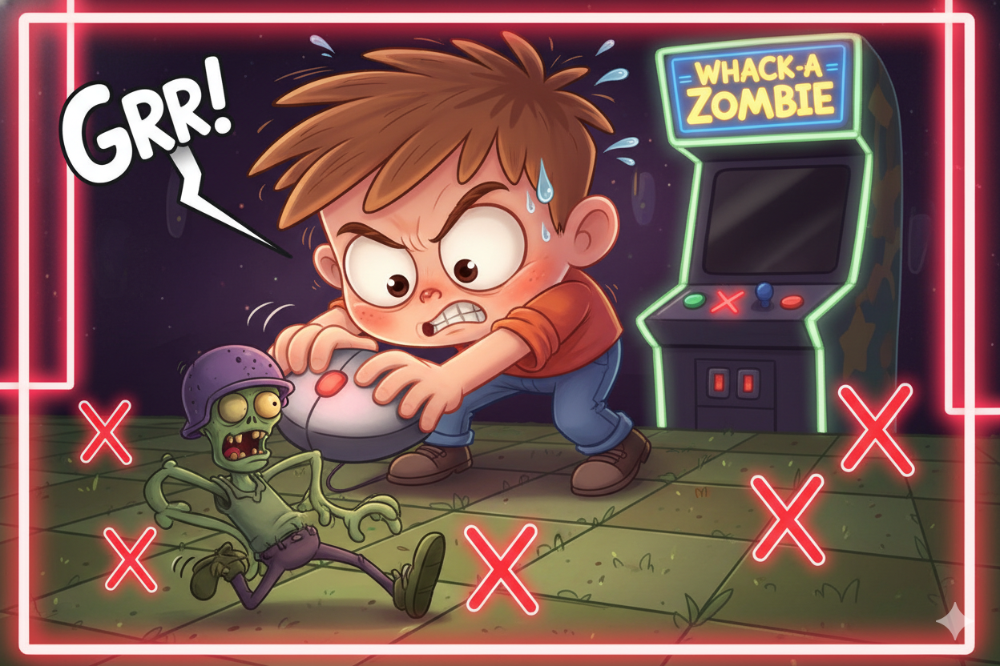
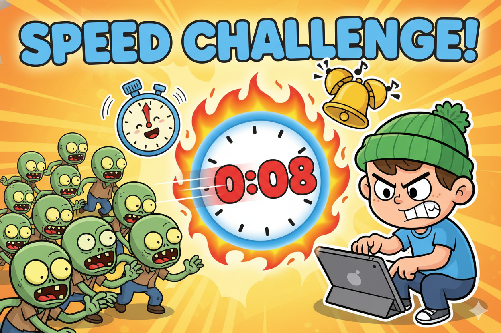
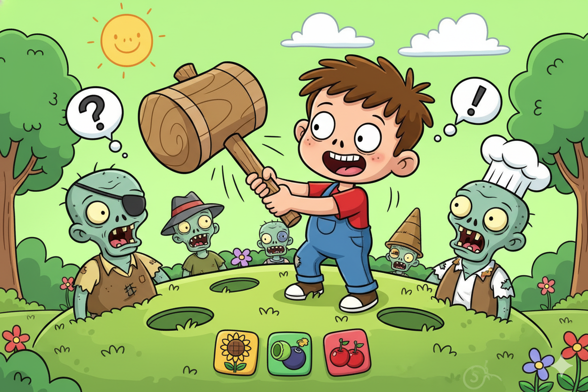

# Level 4.5 Uitdagingen

## Opwarmer

### Mis-klik

Voeg een straf toe als je naast de zombie klikt: -1 score en een geluid.



**Hint:** Voeg een `else:` toe aan de `if zombie.collidepoint(pos):` check

??? note "Spieken"
    ```python
    def on_mouse_down(pos):
        global score

        if zombie.collidepoint(pos):
            sounds.whack.play()
            score += 1
            plaats_zombie()
        else:
            sounds.miss.play()
            score -= 1
    ```

**Benodigde geluiden:** `miss.wav` in de `sounds/` map

---

## Pittig

### Timer

Voeg een countdown timer toe van 30 seconden. Als de tijd op is, is het game over!



**Hint:** Maak een `tijd = 30` variabele en gebruik `update(dt)` om af te tellen. Teken de tijd met `screen.draw.text()`.

??? note "Spieken"
    ```python
    tijd = 30
    game_over = False

    def update(dt):
        global tijd, game_over
        if not game_over:
            tijd -= dt
            if tijd <= 0:
                tijd = 0
                game_over = True

    def draw():
        screen.fill("darkgreen")

        if game_over:
            screen.draw.text("GAME OVER!", center=(400, 250), fontsize=60, color="red")
            screen.draw.text(f"Score: {score}", center=(400, 320), fontsize=40, color="white")
        else:
            zombie.draw()
            screen.draw.text(f"Score: {score}", topleft=(10, 10), fontsize=30, color="white")
            screen.draw.text(f"Tijd: {int(tijd)}", topright=(790, 10), fontsize=30, color="white")

    def on_mouse_down(pos):
        global score
        if game_over:
            return
        # ... bestaande klik code ...
    ```

---

## Boss

### Meerdere Zombies

Laat 3 zombies tegelijk op het scherm verschijnen. Elke zombie die je klikt geeft een punt!



**Hint:** Maak een lijst `zombies = [Actor("zombie"), Actor("zombie"), Actor("zombie")]` en gebruik een `for` loop in `draw()` en `on_mouse_down()`

??? note "Spieken"
    ```python
    zombies = [Actor("zombie"), Actor("zombie"), Actor("zombie")]

    def plaats_zombie(z):
        """Zet een zombie op een willekeurige plek."""
        z.x = random.randint(50, WIDTH - 50)
        z.y = random.randint(50, HEIGHT - 50)

    # Zet alle zombies op een startpositie
    for z in zombies:
        plaats_zombie(z)

    def draw():
        screen.fill("darkgreen")
        for z in zombies:
            z.draw()
        screen.draw.text(f"Score: {score}", topleft=(10, 10), fontsize=30, color="white")

    def on_mouse_down(pos):
        global score
        for z in zombies:
            if z.collidepoint(pos):
                sounds.whack.play()
                score += 1
                plaats_zombie(z)
                break  # Maar 1 zombie per klik!
    ```
