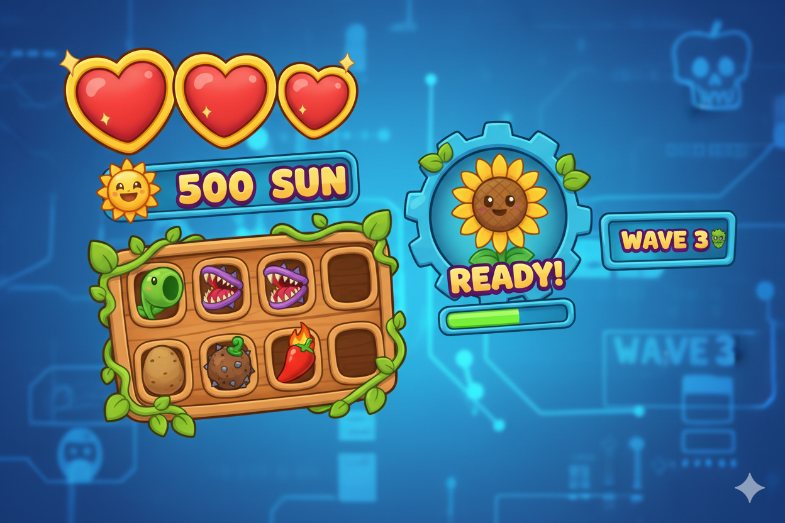
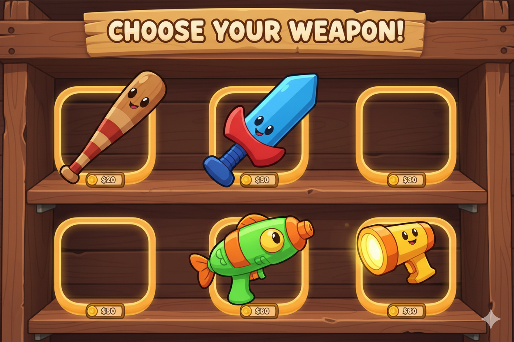
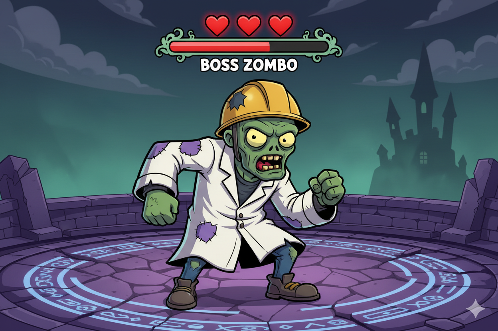

# Level 4 Uitdagingen

## Opwarmer

### Status Verbeteren

Pas `toon_status()` aan om ook het aantal items te tonen



**Hint:** Gebruik `len(inventory)` om het aantal items te tellen

??? note "Spieken"
    ```python
    def toon_status(levens, score, inventory):
        print()
        print(f"Levens: {levens} | Score: {score} | Items: {len(inventory)}")
        if inventory:
            print(f"   Inventory: {inventory}")
        print()
    ```

---

## Pittig

### Meerdere Wapens

Pas `vecht()` aan en voeg andere wapens toe als mogelijke inventory.



**Hint:** Verander `heeft_wapen` naar `wapen_type` (None, "honkbalknuppel", "zwaard", etc.)

??? note "Spieken"
    ```python
    def vecht(zombie, wapen_type):
        print("Je maakt je klaar om te vechten...")

        if wapen_type == "zwaard":
            print("   Je zwaait met je zwaard!")
            bonus = 2
        elif wapen_type == "honkbalknuppel":
            print("   Je zwaait met je knuppel!")
            bonus = 1
        else:
            print("   Je balt je vuisten...")
            bonus = 0

        moeilijkheid = bereken_winkans(zombie, wapen_type is not None)
        kans = random.randint(1, max(1, moeilijkheid - bonus))

        return kans == 1
    ```

---


## Boss

### Zombie HP

Geef zombies meerdere levens zodat je ze vaker moet raken



**Hint:** Voeg `"hp": 2` toe aan de zombie dictionary in `maak_zombie()`. Bij vechten: `zombie["hp"] -= 1` en check of hp 0 is.

??? note "Spieken"
    ```python
    def maak_zombie():
        # Elk type heeft een naam en HP
        types = [
            ("baby zombie", 1),
            ("langzame zombie", 2),
            ("snelle zombie", 2),
            ("sterke zombie", 3),
        ]

        zombie_type, hp = random.choice(types)

        return {
            "type": zombie_type,
            "naam": random.choice(["Gerrit", "Jan", "Koen"]),
            "hp": hp
        }

    # In main(), bij vechten:
    if vecht(zombie, heeft_wapen):
        zombie["hp"] -= 1
        if zombie["hp"] <= 0:
            print(f"{zombie['naam']} is verslagen!")
            score += 10
        else:
            print(f"{zombie['naam']} heeft nog {zombie['hp']} HP!")
            # Zombie valt opnieuw aan in dezelfde ronde
    ```

