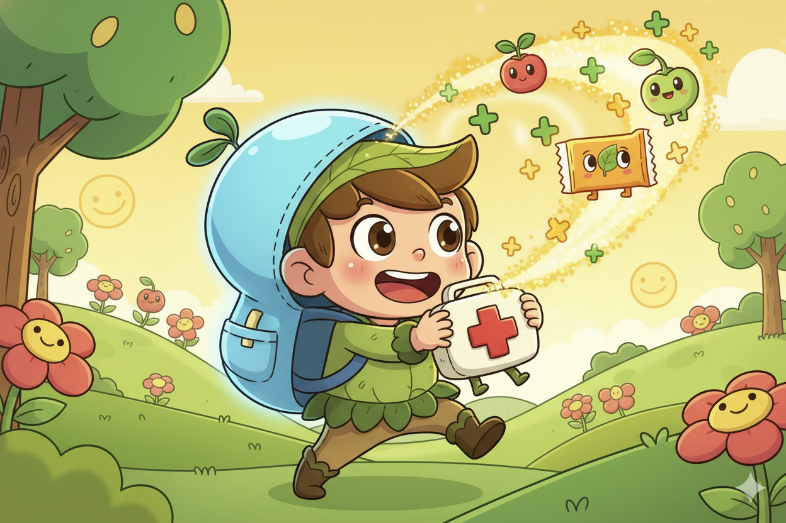
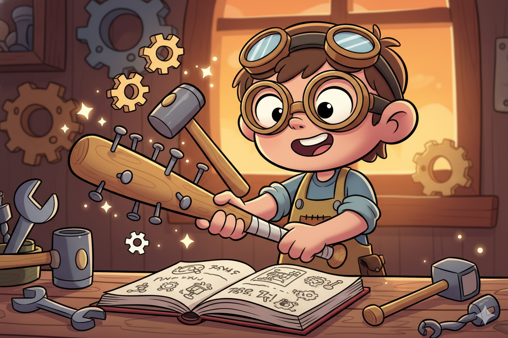

# Level 4 Uitdagingen

## Opwarmer

### Status Verbeteren

Pas `toon_status()` aan om ook het aantal items te tonen


**Hint:** Gebruik `len(inventory)` om het aantal items te tellen

??? note "Spieken"
    ```python
    def toon_status(levens, score, inventory):
        print()
        print(f"Levens: {levens} | Score: {score} | Items: {len(inventory)}")
        if inventory:
            print(f"   Inventory: {inventory}")
        print()
    ```

---

### Gebruik Item

Maak een nieuwe functie `gebruik_item(item, levens, inventory)` die een item uit je inventory gebruikt.



- Medkit: +2 levens
- Energie bar: +1 leven
- De functie returned het nieuwe aantal levens
- Roep de functie aan in `main()` in plaats van de bestaande medkit code

**Hint:** Maak een `def gebruik_item(item, levens, inventory):` met `if item == "medkit":` en `return levens`

??? note "Spieken"
    ```python
    def gebruik_item(item, levens, inventory):
        """Gebruik een item en geef het nieuwe aantal levens terug."""
        if item == "medkit":
            print("💊 Je gebruikt een medkit!")
            inventory.remove("medkit")
            levens += 2
            print(f"   +2 levens! (nu: {levens})")
        elif item == "energie bar":
            print("🍫 Je eet een energie bar!")
            inventory.remove("energie bar")
            levens += 1
            print(f"   +1 leven! (nu: {levens})")
        else:
            print(f"Je kunt {item} niet gebruiken.")

        return levens

    # In main(), vervang de medkit code met:
    if levens < 3 and ("medkit" in inventory or "energie bar" in inventory):
        print("Je hebt healing items!")
        for item in ["medkit", "energie bar"]:
            if item in inventory:
                print(f"   - {item}")
        keuze = input("Welk item gebruiken? (of 'nee') ➜ ").lower()
        if keuze in inventory:
            levens = gebruik_item(keuze, levens, inventory)
    ```

---

## Pittig

### Meerdere Wapens

Pas `vecht()` aan en voeg andere wapens toe als mogelijke inventory.


**Hint:** Verander `heeft_wapen` naar `wapen_type` (None, "honkbalknuppel", "zwaard", etc.)

??? note "Spieken"
    ```python
    def vecht(zombie, wapen_type):
        print("Je maakt je klaar om te vechten...")

        if wapen_type == "zwaard":
            print("   Je zwaait met je zwaard!")
            bonus = 2
        elif wapen_type == "honkbalknuppel":
            print("   Je zwaait met je knuppel!")
            bonus = 1
        else:
            print("   Je balt je vuisten...")
            bonus = 0

        moeilijkheid = bereken_winkans(zombie, wapen_type is not None)
        kans = random.randint(1, max(1, moeilijkheid - bonus))

        return kans == 1
    ```

---

### Crafting

Maak een `craft(inventory)` functie die twee items combineert tot iets beters. Gebruik een `recepten` dictionary.



- Honkbalknuppel + spijkers = spijkerknuppel
- Zaklamp + batterij = super zaklamp
- Voeg "craft" toe als actie in het spel

**Hint:** Maak een dictionary `recepten = {"spijkerknuppel": ["honkbalknuppel", "spijkers"]}` en check of beide items in de inventory zitten

??? note "Spieken"
    ```python
    recepten = {
        "spijkerknuppel": ["honkbalknuppel", "spijkers"],
        "super zaklamp": ["zaklamp", "batterij"],
    }

    def craft(inventory):
        """Probeer items te combineren tot iets beters."""
        print("🔧 Crafting recepten:")
        for resultaat, ingredienten in recepten.items():
            print(f"   {ingredienten[0]} + {ingredienten[1]} = {resultaat}")

        for resultaat, ingredienten in recepten.items():
            if ingredienten[0] in inventory and ingredienten[1] in inventory:
                print(f"✨ Je maakt een {resultaat}!")
                inventory.remove(ingredienten[0])
                inventory.remove(ingredienten[1])
                inventory.append(resultaat)
                return

        print("Je hebt niet de juiste items...")

    # In main(), voeg toe als actie:
    elif actie == "craft":
        craft(inventory)
    ```

---

## Boss

### Zombie HP

Geef zombies meerdere levens zodat je ze vaker moet raken


**Hint:** Voeg `"hp": 2` toe aan de zombie dictionary in `maak_zombie()`. Bij vechten: `zombie["hp"] -= 1` en check of hp 0 is.

??? note "Spieken"
    ```python
    def maak_zombie():
        # Elk type heeft een naam en HP
        types = [
            ("baby zombie", 1),
            ("langzame zombie", 2),
            ("snelle zombie", 2),
            ("sterke zombie", 3),
        ]

        zombie_type, hp = random.choice(types)

        return {
            "type": zombie_type,
            "naam": random.choice(["Gerrit", "Jan", "Koen"]),
            "hp": hp
        }

    # In main(), bij vechten:
    if vecht(zombie, heeft_wapen):
        zombie["hp"] -= 1
        if zombie["hp"] <= 0:
            print(f"{zombie['naam']} is verslagen!")
            score += 10
        else:
            print(f"{zombie['naam']} heeft nog {zombie['hp']} HP!")
            # Zombie valt opnieuw aan in dezelfde ronde
    ```

