# Zombiepedia

!!! warning "Level 6: Bouw Je Eigen Spel!"
    Dit is **Level 6** - de ultieme uitdaging!

    Er is geen startcode. Je bouwt het **helemaal zelf** vanaf nul.

    Gebruik alles wat je geleerd hebt in Level 1-5 om een slimmer zombie spel te maken waar de stats van elke zombie ertoe doen!

## De Uitdaging

Maak een spel waar je **tactisch** moet nadenken:

- **Snelle zombie?** → Rennen werkt niet!
- **Slimme zombie?** → Verstoppen werkt niet!
- **Sterke zombie?** → Vechten zonder wapen werkt niet!

Kies het juiste wapen, de juiste actie, en overleef!

<div class="grid cards" markdown>

-   :material-sword:{ .lg .middle } **Wapens Systeem**

    ---

    Verschillende wapens werken beter tegen bepaalde zombies

-   :material-head-question:{ .lg .middle } **Slimme AI**

    ---

    Gebruik de stats om kansen te berekenen

-   :material-treasure-chest:{ .lg .middle } **Inventory**

    ---

    Verzamel items en kies wanneer je ze gebruikt

-   :material-map-marker-path:{ .lg .middle } **Meerdere Locaties**

    ---

    Elke locatie heeft andere zombie types

</div>

---

## Makkelijk

<div class="zombie-grid">

<div class="zombie-card tier-easy">
    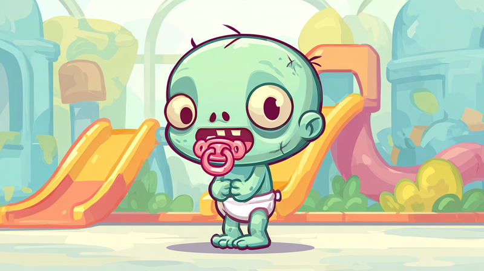
    <h3>Baby Zombie</h3>
    <div class="stats">
        <div class="stat"><span class="label">Snelheid</span><span class="bar"><span style="width:40%"></span></span></div>
        <div class="stat"><span class="label">Slimheid</span><span class="bar"><span style="width:20%"></span></span></div>
        <div class="stat"><span class="label">Kracht</span><span class="bar"><span style="width:20%"></span></span></div>
    </div>
    <p class="description">"Wil alleen maar spelen... en je hersenen eten."</p>
    <p class="weakness">Zwakte: Afgeleid door speelgoed</p>
    <div class="tactics">
        <span class="tactic good">Vechten</span>
        <span class="tactic good">Rennen</span>
        <span class="tactic good">Verstoppen</span>
    </div>
</div>

<div class="zombie-card tier-easy">
    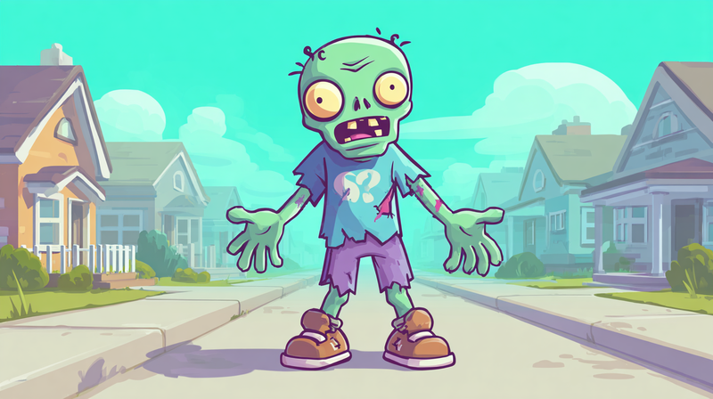
    <h3>Langzame Zombie</h3>
    <div class="stats">
        <div class="stat"><span class="label">Snelheid</span><span class="bar"><span style="width:20%"></span></span></div>
        <div class="stat"><span class="label">Slimheid</span><span class="bar"><span style="width:20%"></span></span></div>
        <div class="stat"><span class="label">Kracht</span><span class="bar"><span style="width:40%"></span></span></div>
    </div>
    <p class="description">"Schuifelt langzaam maar zeker je richting op. Geen haast."</p>
    <p class="weakness">Zwakte: Wandelen is al te snel</p>
    <div class="tactics">
        <span class="tactic good">Vechten</span>
        <span class="tactic good">Rennen</span>
        <span class="tactic good">Verstoppen</span>
    </div>
</div>

<div class="zombie-card tier-easy">
    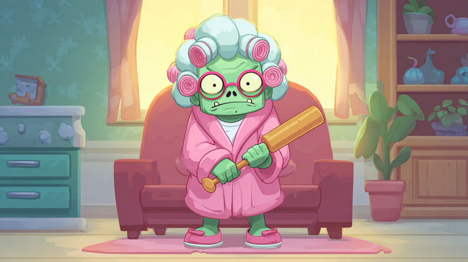
    <h3>Oma Zombie</h3>
    <div class="stats">
        <div class="stat"><span class="label">Snelheid</span><span class="bar"><span style="width:20%"></span></span></div>
        <div class="stat"><span class="label">Slimheid</span><span class="bar"><span style="width:40%"></span></span></div>
        <div class="stat"><span class="label">Kracht</span><span class="bar"><span style="width:20%"></span></span></div>
    </div>
    <p class="description">"Wil je een koekje geven... een HERSENEN koekje!"</p>
    <p class="weakness">Zwakte: Kan haar bril niet vinden</p>
    <div class="tactics">
        <span class="tactic good">Vechten</span>
        <span class="tactic good">Rennen</span>
        <span class="tactic good">Verstoppen</span>
    </div>
</div>

<div class="zombie-card tier-easy">
    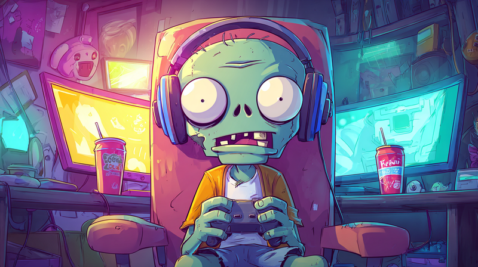
    <h3>Gamer Zombie</h3>
    <div class="stats">
        <div class="stat"><span class="label">Snelheid</span><span class="bar"><span style="width:20%"></span></span></div>
        <div class="stat"><span class="label">Slimheid</span><span class="bar"><span style="width:60%"></span></span></div>
        <div class="stat"><span class="label">Kracht</span><span class="bar"><span style="width:20%"></span></span></div>
    </div>
    <p class="description">"Nog één potje... nog één potje... HERSENEN!"</p>
    <p class="weakness">Zwakte: Zit vastgeplakt aan z'n stoel</p>
    <div class="tactics">
        <span class="tactic good">Vechten</span>
        <span class="tactic good">Rennen</span>
        <span class="tactic ok">Verstoppen</span>
    </div>
</div>

</div>

---

## Gemiddeld

<div class="zombie-grid">

<div class="zombie-card tier-medium">
    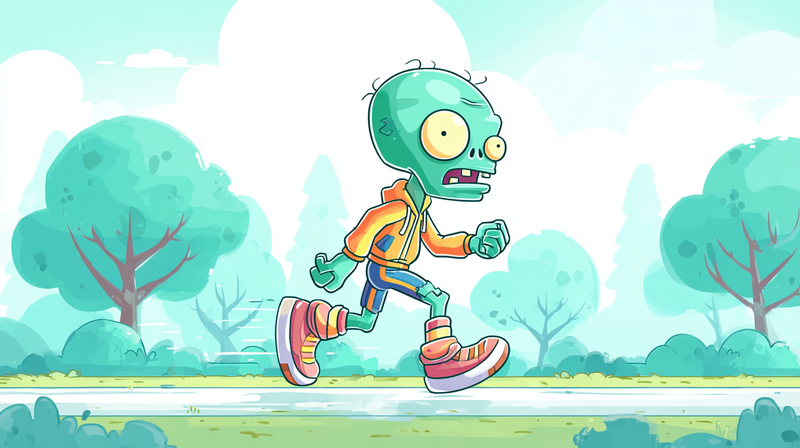
    <h3>Snelle Zombie</h3>
    <div class="stats">
        <div class="stat"><span class="label">Snelheid</span><span class="bar"><span style="width:80%"></span></span></div>
        <div class="stat"><span class="label">Slimheid</span><span class="bar"><span style="width:40%"></span></span></div>
        <div class="stat"><span class="label">Kracht</span><span class="bar"><span style="width:40%"></span></span></div>
    </div>
    <p class="description">"ZOOM! Was dat een zombie of een raket?!"</p>
    <p class="weakness">Zwakte: Rent tegen muren aan</p>
    <div class="tactics">
        <span class="tactic bad">Rennen</span>
        <span class="tactic good">Verstoppen</span>
        <span class="tactic ok">Vechten</span>
    </div>
</div>

<div class="zombie-card tier-medium">
    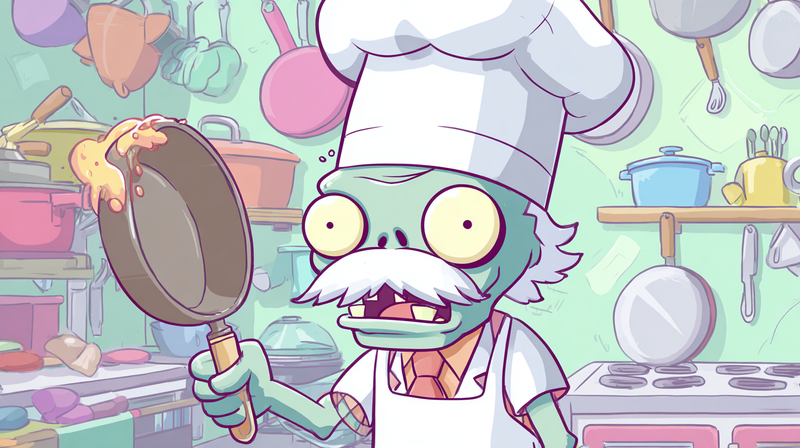
    <h3>Chef Zombie</h3>
    <div class="stats">
        <div class="stat"><span class="label">Snelheid</span><span class="bar"><span style="width:40%"></span></span></div>
        <div class="stat"><span class="label">Slimheid</span><span class="bar"><span style="width:60%"></span></span></div>
        <div class="stat"><span class="label">Kracht</span><span class="bar"><span style="width:40%"></span></span></div>
    </div>
    <p class="description">"Vandaag op het menu: verse hersenen à la carte!"</p>
    <p class="weakness">Zwakte: Perfectionist - moet alles perfect bereiden</p>
    <div class="tactics">
        <span class="tactic ok">Rennen</span>
        <span class="tactic ok">Verstoppen</span>
        <span class="tactic ok">Vechten</span>
    </div>
</div>

<div class="zombie-card tier-medium">
    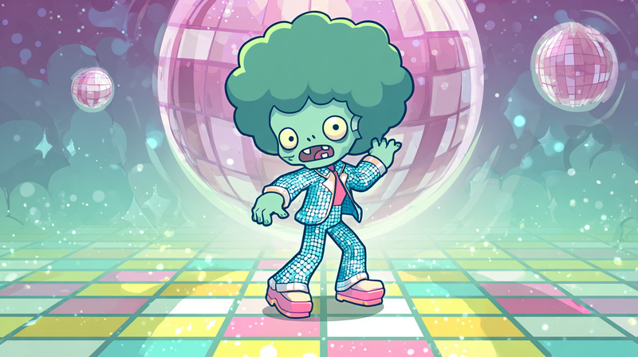
    <h3>Disco Zombie</h3>
    <div class="stats">
        <div class="stat"><span class="label">Snelheid</span><span class="bar"><span style="width:60%"></span></span></div>
        <div class="stat"><span class="label">Slimheid</span><span class="bar"><span style="width:40%"></span></span></div>
        <div class="stat"><span class="label">Kracht</span><span class="bar"><span style="width:40%"></span></span></div>
    </div>
    <p class="description">"Stayin' alive! Stayin' alive! Oh wacht... te laat."</p>
    <p class="weakness">Zwakte: Kan niet stoppen met dansen</p>
    <div class="tactics">
        <span class="tactic ok">Rennen</span>
        <span class="tactic good">Verstoppen</span>
        <span class="tactic ok">Vechten</span>
    </div>
</div>

<div class="zombie-card tier-medium">
    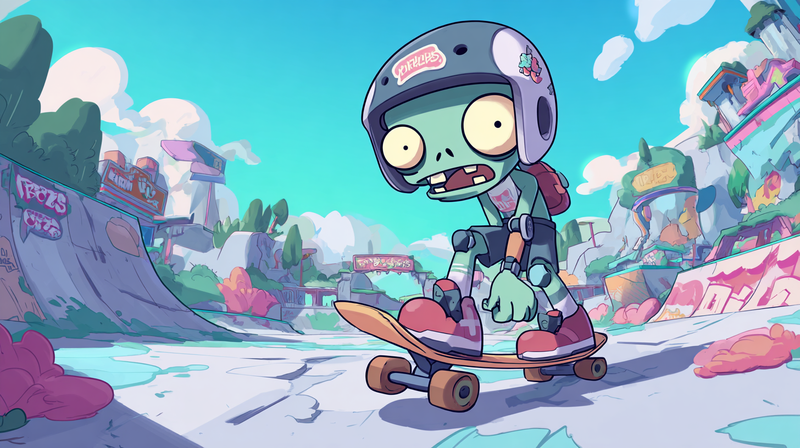
    <h3>Skater Zombie</h3>
    <div class="stats">
        <div class="stat"><span class="label">Snelheid</span><span class="bar"><span style="width:80%"></span></span></div>
        <div class="stat"><span class="label">Slimheid</span><span class="bar"><span style="width:40%"></span></span></div>
        <div class="stat"><span class="label">Kracht</span><span class="bar"><span style="width:40%"></span></span></div>
    </div>
    <p class="description">"Sick kickflip bro! Nu sick bite bro!"</p>
    <p class="weakness">Zwakte: Valt bij elke stoeprand</p>
    <div class="tactics">
        <span class="tactic bad">Rennen</span>
        <span class="tactic good">Verstoppen</span>
        <span class="tactic ok">Vechten</span>
    </div>
</div>

<div class="zombie-card tier-medium">
    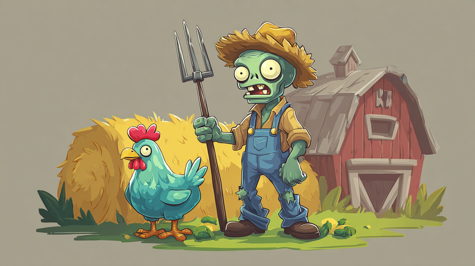
    <h3>Boer Zombie</h3>
    <div class="stats">
        <div class="stat"><span class="label">Snelheid</span><span class="bar"><span style="width:40%"></span></span></div>
        <div class="stat"><span class="label">Slimheid</span><span class="bar"><span style="width:40%"></span></span></div>
        <div class="stat"><span class="label">Kracht</span><span class="bar"><span style="width:60%"></span></span></div>
    </div>
    <p class="description">"Tijd om te oogsten... HERSENEN te oogsten!"</p>
    <p class="weakness">Zwakte: Hooivork zit vast in de grond</p>
    <div class="tactics">
        <span class="tactic ok">Rennen</span>
        <span class="tactic ok">Verstoppen</span>
        <span class="tactic ok">Vechten</span>
    </div>
</div>

<div class="zombie-card tier-medium">
    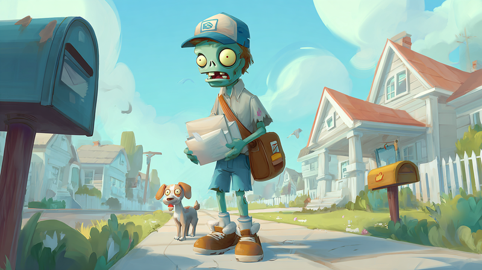
    <h3>Postbode Zombie</h3>
    <div class="stats">
        <div class="stat"><span class="label">Snelheid</span><span class="bar"><span style="width:60%"></span></span></div>
        <div class="stat"><span class="label">Slimheid</span><span class="bar"><span style="width:60%"></span></span></div>
        <div class="stat"><span class="label">Kracht</span><span class="bar"><span style="width:40%"></span></span></div>
    </div>
    <p class="description">"Pakketje voor u! Het is... UW ONDERGANG!"</p>
    <p class="weakness">Zwakte: Moet elke brievenbus checken</p>
    <div class="tactics">
        <span class="tactic ok">Rennen</span>
        <span class="tactic ok">Verstoppen</span>
        <span class="tactic ok">Vechten</span>
    </div>
</div>

<div class="zombie-card tier-medium">
    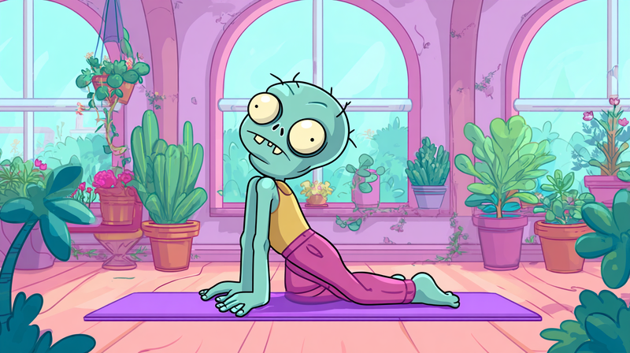
    <h3>Yoga Zombie</h3>
    <div class="stats">
        <div class="stat"><span class="label">Snelheid</span><span class="bar"><span style="width:40%"></span></span></div>
        <div class="stat"><span class="label">Slimheid</span><span class="bar"><span style="width:60%"></span></span></div>
        <div class="stat"><span class="label">Kracht</span><span class="bar"><span style="width:40%"></span></span></div>
    </div>
    <p class="description">"Namaste... nu ga ik je OPETEN-ste!"</p>
    <p class="weakness">Zwakte: Moet eerst stretchen</p>
    <div class="tactics">
        <span class="tactic good">Rennen</span>
        <span class="tactic ok">Verstoppen</span>
        <span class="tactic ok">Vechten</span>
    </div>
</div>

<div class="zombie-card tier-medium">
    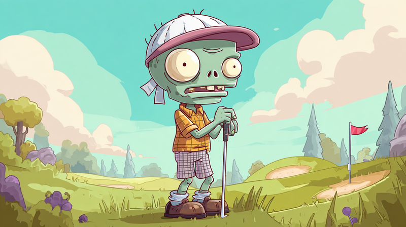
    <h3>Golf Zombie</h3>
    <div class="stats">
        <div class="stat"><span class="label">Snelheid</span><span class="bar"><span style="width:40%"></span></span></div>
        <div class="stat"><span class="label">Slimheid</span><span class="bar"><span style="width:60%"></span></span></div>
        <div class="stat"><span class="label">Kracht</span><span class="bar"><span style="width:60%"></span></span></div>
    </div>
    <p class="description">"FORE! Oh sorry, ik bedoel: HERSENEN!"</p>
    <p class="weakness">Zwakte: Moet eerst z'n handicap berekenen</p>
    <div class="tactics">
        <span class="tactic ok">Rennen</span>
        <span class="tactic ok">Verstoppen</span>
        <span class="tactic bad">Vechten</span>
    </div>
</div>

</div>

---

## Moeilijk

<div class="zombie-grid">

<div class="zombie-card tier-hard">
    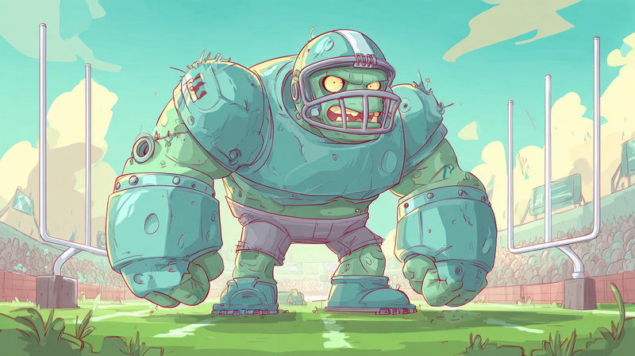
    <h3>Tank Zombie</h3>
    <div class="stats">
        <div class="stat"><span class="label">Snelheid</span><span class="bar"><span style="width:20%"></span></span></div>
        <div class="stat"><span class="label">Slimheid</span><span class="bar"><span style="width:20%"></span></span></div>
        <div class="stat"><span class="label">Kracht</span><span class="bar"><span style="width:100%"></span></span></div>
    </div>
    <p class="description">"HULK SMASH! Maar dan met meer kwijl."</p>
    <p class="weakness">Zwakte: Past niet door deuren</p>
    <div class="tactics">
        <span class="tactic good">Rennen</span>
        <span class="tactic good">Verstoppen</span>
        <span class="tactic bad">Vechten</span>
    </div>
</div>

<div class="zombie-card tier-hard">
    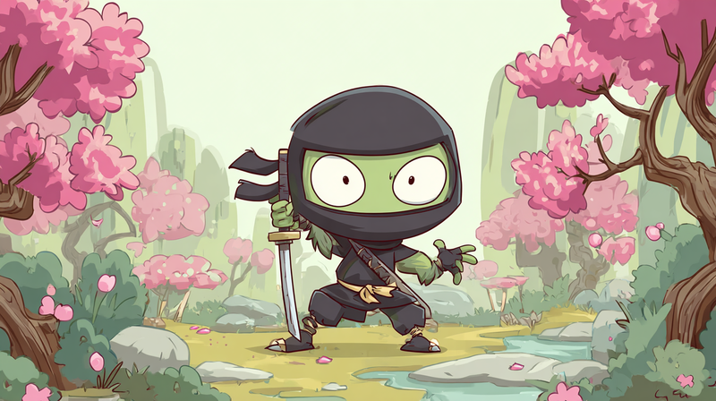
    <h3>Ninja Zombie</h3>
    <div class="stats">
        <div class="stat"><span class="label">Snelheid</span><span class="bar"><span style="width:100%"></span></span></div>
        <div class="stat"><span class="label">Slimheid</span><span class="bar"><span style="width:80%"></span></span></div>
        <div class="stat"><span class="label">Kracht</span><span class="bar"><span style="width:60%"></span></span></div>
    </div>
    <p class="description">"Je ziet me niet, je ziet me niet, je ziet me- BOE!"</p>
    <p class="weakness">Zwakte: Zaklamp verblindt hem</p>
    <div class="tactics">
        <span class="tactic bad">Rennen</span>
        <span class="tactic bad">Verstoppen</span>
        <span class="tactic ok">Vechten + Zaklamp</span>
    </div>
</div>

<div class="zombie-card tier-hard">
    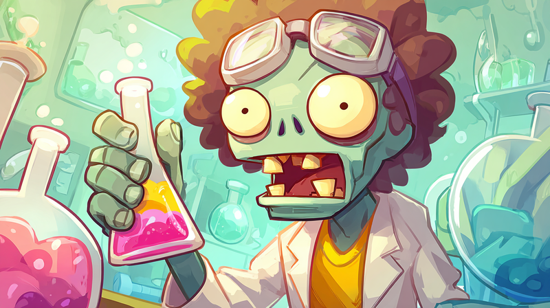
    <h3>Wetenschapper Zombie</h3>
    <div class="stats">
        <div class="stat"><span class="label">Snelheid</span><span class="bar"><span style="width:40%"></span></span></div>
        <div class="stat"><span class="label">Slimheid</span><span class="bar"><span style="width:100%"></span></span></div>
        <div class="stat"><span class="label">Kracht</span><span class="bar"><span style="width:40%"></span></span></div>
    </div>
    <p class="description">"Interessant... je hersenen zijn 1.4kg. Dat weet ik ZEKER straks."</p>
    <p class="weakness">Zwakte: Moet eerst een hypothese opstellen</p>
    <div class="tactics">
        <span class="tactic good">Rennen</span>
        <span class="tactic bad">Verstoppen</span>
        <span class="tactic ok">Vechten</span>
    </div>
</div>

<div class="zombie-card tier-hard">
    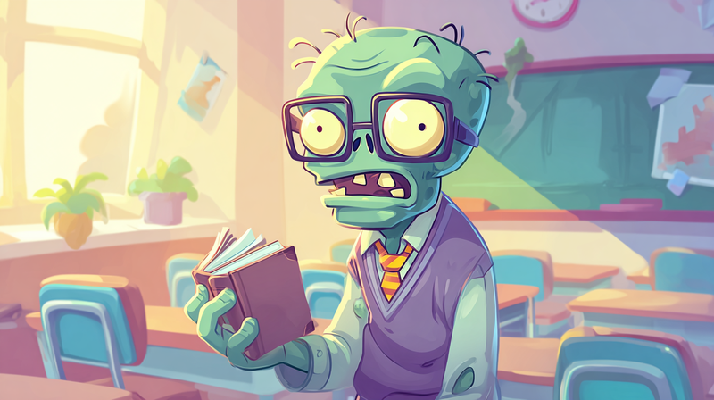
    <h3>Leraar Zombie</h3>
    <div class="stats">
        <div class="stat"><span class="label">Snelheid</span><span class="bar"><span style="width:40%"></span></span></div>
        <div class="stat"><span class="label">Slimheid</span><span class="bar"><span style="width:80%"></span></span></div>
        <div class="stat"><span class="label">Kracht</span><span class="bar"><span style="width:40%"></span></span></div>
    </div>
    <p class="description">"Pop quiz: hoeveel hersenen heb jij? ANTWOORD: NIET LANG MEER!"</p>
    <p class="weakness">Zwakte: Moet alles drie keer uitleggen</p>
    <div class="tactics">
        <span class="tactic good">Rennen</span>
        <span class="tactic bad">Verstoppen</span>
        <span class="tactic ok">Vechten</span>
    </div>
</div>

<div class="zombie-card tier-hard">
    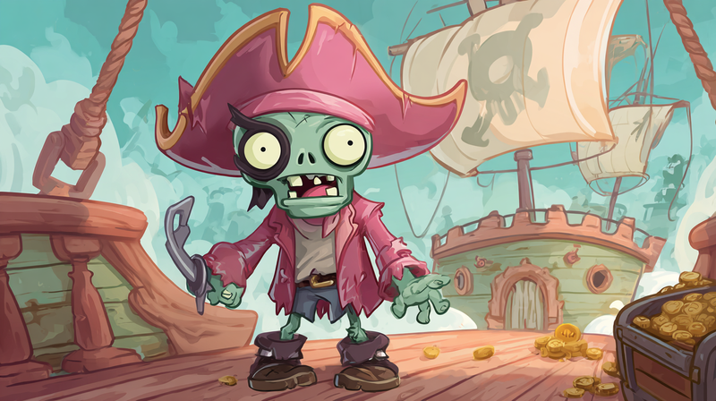
    <h3>Piraat Zombie</h3>
    <div class="stats">
        <div class="stat"><span class="label">Snelheid</span><span class="bar"><span style="width:60%"></span></span></div>
        <div class="stat"><span class="label">Slimheid</span><span class="bar"><span style="width:60%"></span></span></div>
        <div class="stat"><span class="label">Kracht</span><span class="bar"><span style="width:80%"></span></span></div>
    </div>
    <p class="description">"ARRR! Waar is me schat? Oh ja: JOUW HERSENEN!"</p>
    <p class="weakness">Zwakte: Kan niet goed zien met één oog</p>
    <div class="tactics">
        <span class="tactic ok">Rennen</span>
        <span class="tactic ok">Verstoppen (rechts)</span>
        <span class="tactic bad">Vechten</span>
    </div>
</div>

<div class="zombie-card tier-hard">
    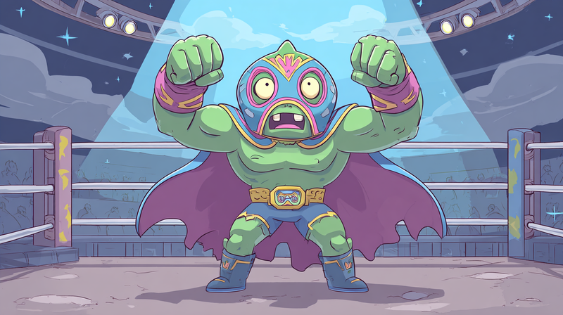
    <h3>Worstelaar Zombie</h3>
    <div class="stats">
        <div class="stat"><span class="label">Snelheid</span><span class="bar"><span style="width:60%"></span></span></div>
        <div class="stat"><span class="label">Slimheid</span><span class="bar"><span style="width:40%"></span></span></div>
        <div class="stat"><span class="label">Kracht</span><span class="bar"><span style="width:100%"></span></span></div>
    </div>
    <p class="description">"AND HIS NAME IS JOHN ZOMBIE! *toetertje*"</p>
    <p class="weakness">Zwakte: Moet eerst z'n entrance doen</p>
    <div class="tactics">
        <span class="tactic ok">Rennen</span>
        <span class="tactic good">Verstoppen</span>
        <span class="tactic bad">Vechten</span>
    </div>
</div>

<div class="zombie-card tier-hard">
    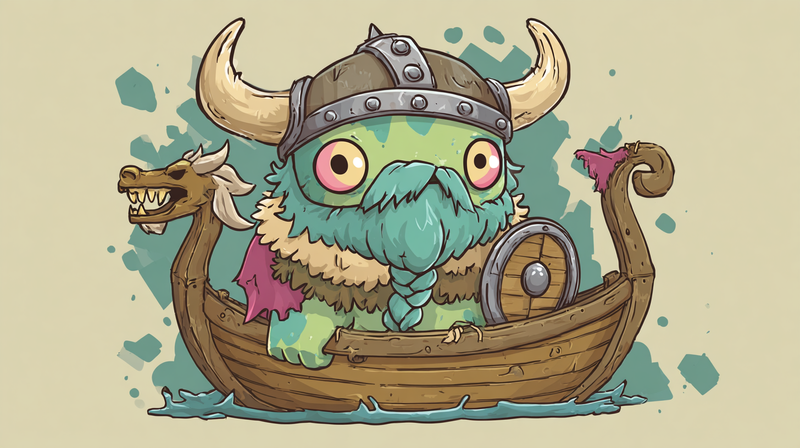
    <h3>Viking Zombie</h3>
    <div class="stats">
        <div class="stat"><span class="label">Snelheid</span><span class="bar"><span style="width:60%"></span></span></div>
        <div class="stat"><span class="label">Slimheid</span><span class="bar"><span style="width:40%"></span></span></div>
        <div class="stat"><span class="label">Kracht</span><span class="bar"><span style="width:100%"></span></span></div>
    </div>
    <p class="description">"VALHALLA! Maar eerst: jouw hersenen als ontbijt!"</p>
    <p class="weakness">Zwakte: Helm zit over z'n ogen</p>
    <div class="tactics">
        <span class="tactic ok">Rennen</span>
        <span class="tactic good">Verstoppen</span>
        <span class="tactic bad">Vechten</span>
    </div>
</div>

</div>

---

## Boss Zombies

<div class="zombie-grid">

<div class="zombie-card tier-boss">
    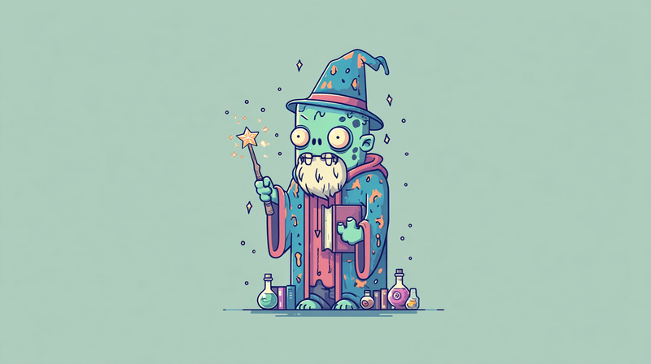
    <h3>Tovenaar Zombie</h3>
    <div class="stats">
        <div class="stat"><span class="label">Snelheid</span><span class="bar"><span style="width:60%"></span></span></div>
        <div class="stat"><span class="label">Slimheid</span><span class="bar"><span style="width:100%"></span></span></div>
        <div class="stat"><span class="label">Kracht</span><span class="bar"><span style="width:80%"></span></span></div>
    </div>
    <p class="description">"Abracadabra... je bent nu DOOD-cadaver!"</p>
    <p class="weakness">Zwakte: Spreuk duurt 3 seconden</p>
    <div class="tactics">
        <span class="tactic ok">Rennen (snel!)</span>
        <span class="tactic bad">Verstoppen</span>
        <span class="tactic bad">Vechten</span>
    </div>
</div>

<div class="zombie-card tier-boss">
    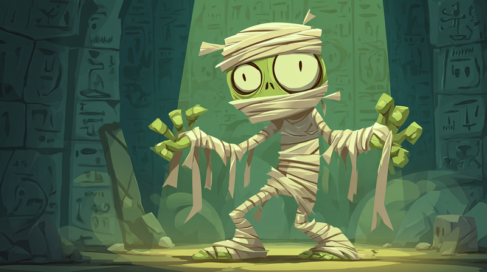
    <h3>Mummie Zombie</h3>
    <div class="stats">
        <div class="stat"><span class="label">Snelheid</span><span class="bar"><span style="width:40%"></span></span></div>
        <div class="stat"><span class="label">Slimheid</span><span class="bar"><span style="width:80%"></span></span></div>
        <div class="stat"><span class="label">Kracht</span><span class="bar"><span style="width:100%"></span></span></div>
    </div>
    <p class="description">"3000 jaar gewacht... nu heb ik HONGER!"</p>
    <p class="weakness">Zwakte: Bandages raken los</p>
    <div class="tactics">
        <span class="tactic good">Rennen</span>
        <span class="tactic bad">Verstoppen</span>
        <span class="tactic bad">Vechten</span>
    </div>
</div>

<div class="zombie-card tier-boss">
    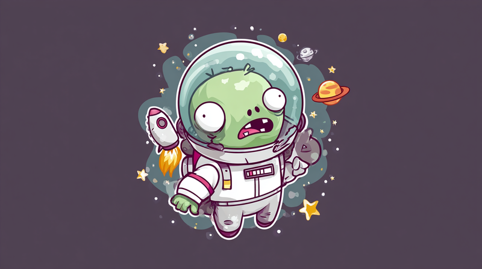
    <h3>Astronaut Zombie</h3>
    <div class="stats">
        <div class="stat"><span class="label">Snelheid</span><span class="bar"><span style="width:40%"></span></span></div>
        <div class="stat"><span class="label">Slimheid</span><span class="bar"><span style="width:100%"></span></span></div>
        <div class="stat"><span class="label">Kracht</span><span class="bar"><span style="width:80%"></span></span></div>
    </div>
    <p class="description">"Houston, we hebben een probleem: IK HEB HONGER!"</p>
    <p class="weakness">Zwakte: Pak is zwaar en log</p>
    <div class="tactics">
        <span class="tactic good">Rennen</span>
        <span class="tactic bad">Verstoppen</span>
        <span class="tactic bad">Vechten</span>
    </div>
</div>

<div class="zombie-card tier-boss">
    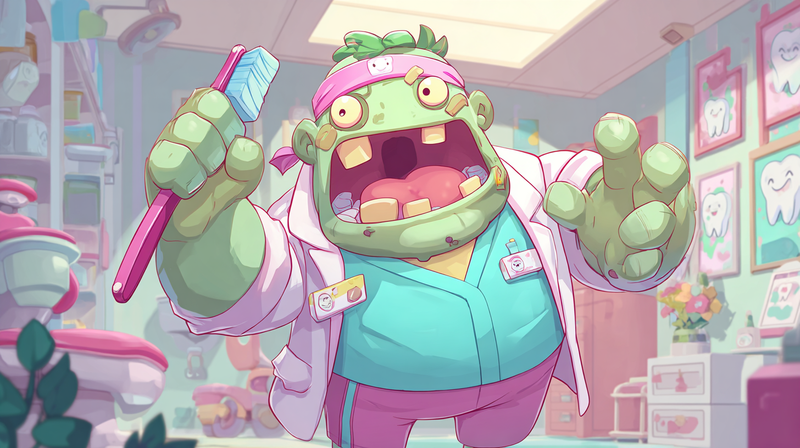
    <h3>Tandarts Zombie</h3>
    <div class="stats">
        <div class="stat"><span class="label">Snelheid</span><span class="bar"><span style="width:60%"></span></span></div>
        <div class="stat"><span class="label">Slimheid</span><span class="bar"><span style="width:100%"></span></span></div>
        <div class="stat"><span class="label">Kracht</span><span class="bar"><span style="width:60%"></span></span></div>
    </div>
    <p class="description">"Open je mond wijd... WIJDER... perfectie!"</p>
    <p class="weakness">Zwakte: Boor maakt irritant geluid</p>
    <div class="tactics">
        <span class="tactic ok">Rennen</span>
        <span class="tactic bad">Verstoppen</span>
        <span class="tactic ok">Vechten + Oordoppen</span>
    </div>
</div>

</div>

---

## Geheime Zombies

<div class="zombie-grid">

<div class="zombie-card tier-secret">
    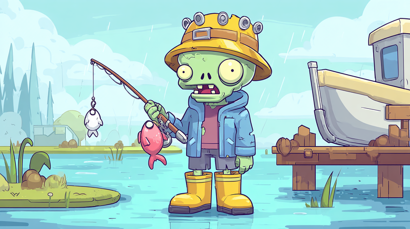
    <h3>??? Zombie</h3>
    <div class="stats">
        <div class="stat"><span class="label">Snelheid</span><span class="bar"><span style="width:0%"></span></span></div>
        <div class="stat"><span class="label">Slimheid</span><span class="bar"><span style="width:0%"></span></span></div>
        <div class="stat"><span class="label">Kracht</span><span class="bar"><span style="width:0%"></span></span></div>
    </div>
    <p class="description">"Versla Level 6 om deze zombie te ontgrendelen!"</p>
    <p class="weakness">Zwakte: ???</p>
    <div class="tactics">
        <span class="tactic unknown">???</span>
    </div>
</div>

<div class="zombie-card tier-secret">
    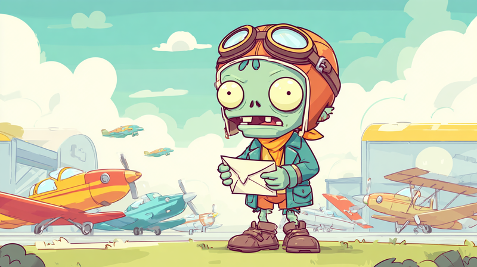
    <h3>??? Zombie</h3>
    <div class="stats">
        <div class="stat"><span class="label">Snelheid</span><span class="bar"><span style="width:0%"></span></span></div>
        <div class="stat"><span class="label">Slimheid</span><span class="bar"><span style="width:0%"></span></span></div>
        <div class="stat"><span class="label">Kracht</span><span class="bar"><span style="width:0%"></span></span></div>
    </div>
    <p class="description">"Versla Level 6 om deze zombie te ontgrendelen!"</p>
    <p class="weakness">Zwakte: ???</p>
    <div class="tactics">
        <span class="tactic unknown">???</span>
    </div>
</div>

<div class="zombie-card tier-secret">
    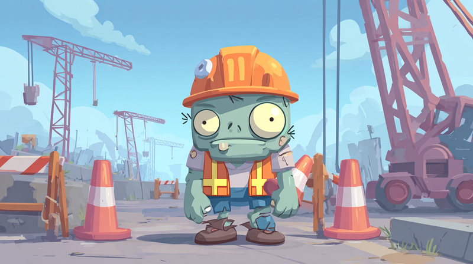
    <h3>??? Zombie</h3>
    <div class="stats">
        <div class="stat"><span class="label">Snelheid</span><span class="bar"><span style="width:0%"></span></span></div>
        <div class="stat"><span class="label">Slimheid</span><span class="bar"><span style="width:0%"></span></span></div>
        <div class="stat"><span class="label">Kracht</span><span class="bar"><span style="width:0%"></span></span></div>
    </div>
    <p class="description">"Versla Level 6 om deze zombie te ontgrendelen!"</p>
    <p class="weakness">Zwakte: ???</p>
    <div class="tactics">
        <span class="tactic unknown">???</span>
    </div>
</div>

</div>

---

---

## Hoe Bouw Je Level 6?

!!! tip "Start Simpel"
    Begin met een **basis versie** en voeg stap voor stap features toe:

    1. **Stap 1:** Maak een dictionary met zombie stats
    2. **Stap 2:** Laat de actie-kans afhangen van de stats
    3. **Stap 3:** Voeg wapens toe die de kansen veranderen
    4. **Stap 4:** Maak het visueel met Pygame Zero

!!! example "Voorbeeld: Zombie Stats"
    ```python
    zombies = {
        "Baby Zombie": {"snelheid": 2, "slimheid": 1, "kracht": 1},
        "Ninja Zombie": {"snelheid": 5, "slimheid": 4, "kracht": 3},
        "Tank Zombie": {"snelheid": 1, "slimheid": 1, "kracht": 5},
    }
    ```

!!! example "Voorbeeld: Slimme Kansen"
    ```python
    def bereken_kans(zombie, actie, wapen):
        stats = zombies[zombie]

        if actie == "rennen":
            # Snelle zombies zijn moeilijk te ontlopen
            kans = 5 - stats["snelheid"]
        elif actie == "verstoppen":
            # Slimme zombies vinden je
            kans = 5 - stats["slimheid"]
        elif actie == "vechten":
            # Sterke zombies zijn moeilijk te verslaan
            kans = 5 - stats["kracht"]
            if wapen:
                kans += 2  # Wapen geeft bonus!

        return random.randint(1, 5) <= kans
    ```

!!! warning "De Regels"
    - **Hoge Snelheid?** → Rennen werkt NIET
    - **Hoge Slimheid?** → Verstoppen werkt NIET
    - **Hoge Kracht?** → Vechten werkt NIET (zonder wapen)

    Combineer je wapen met de zwakte van de zombie voor de beste kans!
